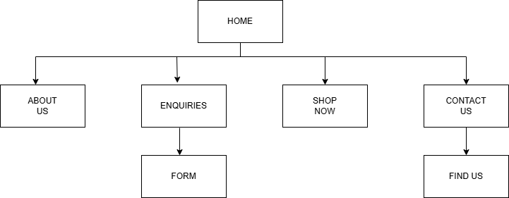

# Project Title
Your project's title

## Student Information
**Student number:** ST10527664  
**Student Name:** Tiisetso Mashidike Matome

## Project Overview

The House Of Crumbs is a bakery that specialises in making quality cakes and bread. The bakery was started in 2020. The House Of Crumbs is very picky about what they use to make their cakes and bread. The House Of Crumbs only uses ingredients of the highest quality. The bakery wants to make high quality cakes and bread that look nice for people who live near them, they also make custom cakes for birthdays and weddings. The House Of Crumbs is trying to sell to people who love food people who plan parties and people who buy gifts for others.

## Website Goals and Objectives

The aim is to show what the bakery can do. This will help get more people to visit the store and order custom cakes. We will know if it is working if we get calls for custom cakes and if people click on "Directions" on our contact page. We want to increase custom cake orders. The bakery’s portfolio is key to achieving this. More "Directions" clicks and custom cake enquiries mean we are, on the track.

## Timeline and Milestones

Timeline: the project should take around 5 weeks 
Planning: WEEK 1
 Development: WEEK 2-4
Testing: WEEK 5

## Sitemap

   

## References

• Creator: Ashwin Kumar
• Source: Pexels
• Reference:
Kumar, A.
Available at: https://www.pexels.com/photo/delicious-red-velvet-cake-slice-with-colorful-decor-33813615/

• Source: Pexels
• Reference:
• creator: Gustavo Fring
Gustavo Fring, Available at: https://www.pexels.com/search/videos/cakes/

Pixabay, 2026. Bakery and baking stock photography interface . Available at: https://pixabay.com 

Shutterstock, 2026. Website review vector graphics search results page . Available at: https://shutterstock.com 

